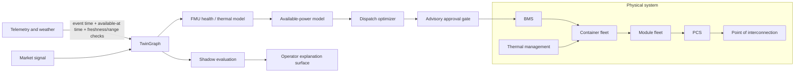

# Public Physical BESS: end-to-end decision-twin showcase

`public_physical_bess_01.twingraph.json` is a synthetic public example of how
TwinGraph becomes the contract that joins a storage plant, its data, its models,
and an operational decision. It is deliberately not an as-built plant, a data
connector, an optimizer implementation, or an FMU distribution.



## What the graph owns

The document is the versioned, compile-checked source of truth for:

- Physical topology: BESS aggregate, containers, module fleet, PCS, BMS,
  thermal system, interconnect, and their typed relationships.
- Decision-time data semantics: every public fixture declares event time,
  availability time, resolution, freshness/range expectations, and an as-of
  policy. A runtime cannot silently look ahead when forming a recommendation.
- Model boundaries: the health/thermal FMU, available-power calibration,
  health-calibration loop, dispatch optimizer, and settlement expression are
  references with named, unit-checked inputs and outputs.
- Decision contract: SOC reserve, cell-temperature, SOH, and health-aware
  available-power limits constrain the recommendation; dispatch remains
  advisory and approval-gated.
- Feedback and audit: measured versus estimated SOH is represented explicitly,
  along with a shadow run, calibration validator, outcome variables, evidence,
  and a stable graph hash.

This prevents a common failure mode in operational systems: the physical model,
telemetry mapping, optimizer assumptions, and operator view drifting into
separate undocumented implementations.

## What an application supplies

An application registers the callable models and owns execution. It may run an
FMI/Modelica engine for the external binding, a solver for the optimizer, and
connectors for telemetry and market data. TwinGraph does not embed those tools;
it makes their interfaces, units, provenance, data availability, and decision
constraints portable and testable before a run is allowed.

## Render the twin

The core produces Mermaid or Graphviz text from the same graph used for
compilation. A product UI can use those typed entities and relations to render
asset-specific cards, line diagrams, thermal overlays, and live state without
creating a second topology model.

```python
import json
from pathlib import Path

import twingraph as tg

graph = tg.TwinGraph.load(
    json.loads(Path("examples/public_physical_bess_01.twingraph.json").read_text())
)
print(tg.to_mermaid(graph))
```

The generated diagram is a structural rendering. A richer battery visual is an
application-level renderer that consumes the same stable TwinGraph contract.
